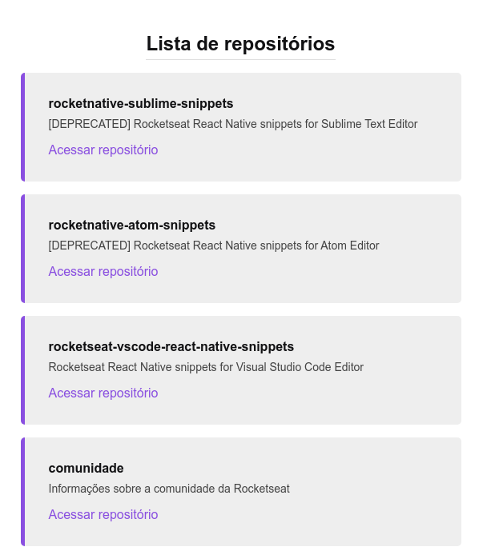

<p align="center">
  
</p>

<h1 align="center">
  Github Explorer
</h1>

<p align="justify">
  Projeto de estudo para entender fundamentos do React, desde a configuração do zero com Babel e Webpack até estados e componentes.
</p>

## 🧠 Aprendizados

- Configuração do Webpack
- Configuração do Babel
- Configuração do Webpack Dev Server
- Source maps para ajudar no debugging
- Entendimento de como funciona a importação de outros arquivos como JSON, CSS e Sass
- Integração com Typescript do zero

<h2 align="center">
💡
</h2>

Configurar o React do zero é importante pra entender conceitos importantes como o funcionamento do Babel e Webpack, o que não é muito evidente quando se usa o create-react-app, por exemplo. É importante para entender como a biblioteca funciona e como as coisas acontecem por "debaixo dos panos".

<h3>🙃 Quer rodar esse projeto?</h3>

1. Clonar o projeto
```bash
git clone https://github.com/raphaeldevs/github-explorer
```

2. Acessar a pasta e instalar dependências
```bash
cd github-explorer && yarn
```

3. Rodar projeto
```bash
yarn dev

# Abrir navegador em localhost:8080
```